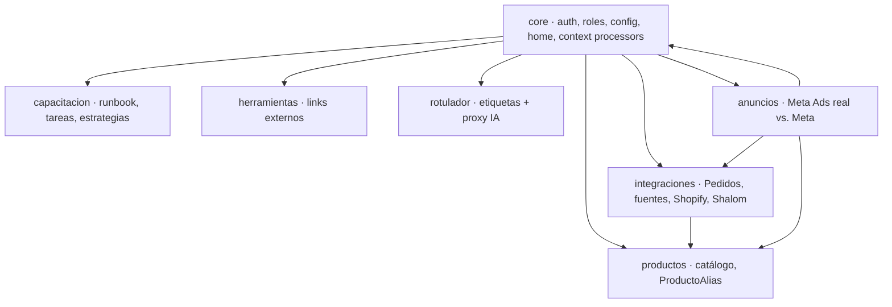

# Arquitectura del sistema · Dashboard

> Cómo funciona todo: qué stack se usa, cómo se sirve una página, cómo fluyen los datos de cada
> integración y qué patrones se repiten. Para el detalle de tablas ver [`ESQUEMA_BD.md`](ESQUEMA_BD.md);
> para conectar Meta Ads, [`CONEXION_META_ADS.md`](CONEXION_META_ADS.md).

---

## 1. En una frase

Es un **monolito Django** (server-side rendering con plantillas, sin SPA), organizado en **apps por
dominio**, con **roles propios** (no Django Groups), que **integra fuentes externas** (Shopify,
Shalom, Meta Ads, IA) cada una con su *connector*, y se despliega con **Gunicorn + WhiteNoise**
detrás de un proxy, sobre **PostgreSQL** en producción.

```
Navegador ──HTTP──► Proxy (HTTPS) ──► Gunicorn ──► Django (config) ──► PostgreSQL
                                                      │
                                  connectors ─────────┼─────────► Shopify / Meta Graph API / Shalom
                                  comandos (cron) ─────┘            n8n (Telegram, salida)
```

---

## 2. Stack

| Capa | Tecnología | Notas |
|---|---|---|
| Lenguaje/Framework | **Django ≥6.0** (Python 3.12) | Monolito, MVT (Model-View-Template) |
| Base de datos | **PostgreSQL** (prod) / **SQLite** (local) | Se elige por la env `DB_HOST`; `CONN_MAX_AGE=600` |
| Servidor app | **Gunicorn** (WSGI) | `config.wsgi` |
| Estáticos | **WhiteNoise** | `CompressedManifestStaticFilesStorage` |
| Sesiones | BD (`django_session`) | `SESSION_ENGINE = db` |
| Caché | **LocMemCache** (por proceso) | Sin Redis por ahora |
| Frontend | Plantillas Django + CSS propio + JS vanilla | Sin framework JS; Chart.js por CDN solo en Publicidad |
| Cifrado | `cryptography` (Fernet) | `EncryptedTextField`, clave derivada del `SECRET_KEY` |
| HTTP externo | `requests` | Connectors de Shopify/Meta/alertas |
| Scraping | `playwright` | Rastreo de envíos Shalom |
| Zona horaria | `America/Lima`, `USE_TZ=True` | Locale `es-pe` |

No hay DRF: las respuestas "API" (edición inline, webhooks, sondeos) son **vistas Django normales**
que devuelven `JsonResponse`.

---

## 3. Apps y responsabilidades



| App | Qué hace | Modelos clave |
|---|---|---|
| **core** | Autenticación, **roles** (`Perfil`), **config global** (`ConfiguracionSistema`), metas, home/KPIs, permisos, signals, context processor | `Perfil`, `ConfiguracionSistema`, `MetaVendedor` |
| **capacitacion** | Runbook diario, tareas/bloques/progreso, **Estrategias** de venta | `Tarea`, `Bloque`, `ProgresoTarea`, `Estrategia` |
| **productos** | Catálogo + multimedia + **alias** para normalizar nombres externos | `Producto`, `ProductoAlias`, `ImagenProducto`, … |
| **herramientas** | Accesos directos a herramientas externas | `HerramientaExterna` |
| **integraciones** | **Pedidos** (vista unificada, Seguimiento, Avances, Registro manual), fuentes, sync **Shopify**, rastreo **Shalom**, historial | `Pedido`, `PedidoItem`, `PedidoSeguimiento`, `PedidoEditLog`, `Integracion` |
| **rotulador** | Generación de rótulos/etiquetas + **proxy a IA** (Anthropic/DeepSeek) | `Rotulo`, `RotuladorConfig` |
| **anuncios** | **Publicidad**: gasto Meta vs. pedidos reales, matching producto↔anuncio, heatmap, alertas | `CuentaPublicitaria`, `CampanaMeta`, `InsightDiarioMeta/Horario`, `MatchProductoAnuncio` |

---

## 4. Cómo se sirve una página (ciclo de request)

```
URL → config/urls.py → <app>/urls.py → vista (@login_required) → permiso (core/permisos.py)
    → ORM (queryset) → context → plantilla (extends base.html) → HTML
                                   ▲
                          context_processor 'runbook' inyecta cfg, puede_editar, puede_ver_ads…
```

1. **Routing:** `config/urls.py` incluye las `urls.py` de cada app (todas montadas en `''`).
2. **Autorización:** casi toda vista usa `@login_required` y luego un helper de
   [`core/permisos.py`](../core/permisos.py) (`puede_ver_pedidos`, `puede_ver_ads`, `es_admin`…).
   Si no tiene permiso → `redirect(destino_vendedor(user))` (evita bucles).
3. **Datos:** ORM con `select_related/prefetch_related`; agregaciones con `.values().annotate()`
   (¡siempre con `.order_by()` para no romper el GROUP BY!).
4. **Render:** la plantilla **extiende `templates/base.html`** (sidebar + topbar + panel derecho).
   El **context processor** `core.context_processors.runbook` inyecta en *todas* las plantillas:
   `cfg` (flags), `puede_editar` (es admin), `puede_ver_ads`, y el resumen del runbook.
5. **Interactividad:** sin recarga, mediante `fetch()` a vistas que devuelven `JsonResponse`
   (edición inline de pedidos, seguimiento, historial, notificaciones, matching).

---

## 5. Roles y permisos (sistema propio, no Django Groups)

```
auth.User ──1:1── core.Perfil (rol: admin | analista | marketing | vendedor)
                       │
        ConfiguracionSistema (flags del vendedor)   ← singleton pk=1
                       │
              core/permisos.py  (helpers que combinan rol + flags)
```

- **admin** (o `is_superuser`): todo.
- **analista**: ve todo en lectura + Avances; edición limitada de Seguimiento.
- **marketing**: módulo Publicidad (dashboards + matching); **no** ve costos ni administra qué se extrae.
- **vendedor**: según **flags** configurables en `ConfiguracionSistema` (ver/editar pedidos,
  seguimiento, registrar, avances…).

El `Perfil` se crea **automáticamente** al crear un `User` vía señal `post_save`
([`core/signals.py`](../core/signals.py)). Las plantillas ocultan UI con `cfg`/`puede_editar`/`puede_ver_ads`.

---

## 6. Flujos de datos por integración

### 6.1 Shopify → Pedidos (pull + push)
```
Sync manual/cron: Admin API /orders.json ──► connectors.extraer_pedidos_shopify
Webhook tiempo real: Shopify ──HMAC──► /integraciones/webhook/shopify/<id>
                              ambos ──► _guardar_pedido_shopify (upsert)
                                          ├─ extrae UTM (landing_site/note_attributes) → Pedido
                                          └─ vincula líneas al catálogo vía ProductoAlias
```
Idempotencia por `unique_together(integracion, external_id)`. El JSON completo se guarda en
`Pedido.datos`.

### 6.2 Meta Ads → Publicidad (conexión **directa**)
```
Ajustes: token cifrado por cuenta ──► connectors.sincronizar (cron o botón)
   Graph API /act_<id>/insights (diario + horario)
        └─► services.ingerir_payload  (respeta incluir_en_extraccion)
            ├─ CampanaMeta (estructura)   ── siempre
            └─ InsightDiario/Horario       ── solo anuncios marcados
Atribución: UTM del pedido (directo) ó MatchProductoAnuncio (por producto, fallback)
Métricas reales: confirmados/entregados desde PedidoEditLog (cuándo cambió de estado)
```
> Alternativa: el webhook `/publicidad/webhook/n8n/` (HMAC) ingiere el mismo `payload`. La vía
> principal es la directa.

### 6.3 Shalom → rastreo de envíos
Scraper con **Playwright** (login + scraping de `pro.shalom.pe`), orquestado por comandos
(`shalom_actualizar`, `shalom_scheduler`) y modelos `ConfigShalom`/`CorridaShalom`/`EnvioShalom`.

### 6.4 Alertas (salida) → n8n → Telegram
```
cron: manage.py alertas_ads ──► services.evaluar_alertas
   CPA real (gasto/entregados) > umbral N días ──► requests.post(n8n_webhook_url)
```
El ERP **no** habla con Telegram directamente; reusa el nodo de n8n. Idempotente con `AlertaEnviada`.

### 6.5 Rotulador → IA
`rotulador/views.py` hace de **proxy** a Anthropic/DeepSeek (`requests.post`), con la API key en
env o en `RotuladorConfig`.

---

## 7. Frontend

- **Server-side rendering**: todo HTML lo arma Django. Una sola plantilla base
  ([`templates/base.html`](../templates/base.html)) con **sidebar + topbar + panel derecho**.
- **Sin framework JS.** Interacciones con `fetch()` a vistas `JsonResponse` (edición inline,
  drawers de historial, notificaciones, matching). Una sola dependencia externa: **Chart.js por
  CDN**, solo en el dashboard de Publicidad.
- **CSS propio** con *CSS variables* y **modo oscuro** (toggle persistido en `localStorage`).
  Hojas por módulo en `core/static/core/css/` (`base.css`, `integraciones.css`, `anuncios.css`…).
- **Patrón de sub-pestañas** persistentes en la URL (`?vista=…`) reutilizado en Pedidos y Publicidad.
- **Notificaciones**: campanita (panel de pedidos recientes) + toasts de "nuevo pedido" con sonido,
  por *polling* a `/pedidos/nuevos/` y `/pedidos/recientes/`.

---

## 8. Patrones transversales (lo que se repite)

| Patrón | Dónde | Para qué |
|---|---|---|
| `EncryptedTextField` | `integraciones/crypto.py` | Tokens/credenciales cifrados (Shopify, Meta) |
| **Connector por proveedor** | `integraciones/connectors.py`, `anuncios/connectors.py` | Aislar la lógica de cada API externa (probar/extraer) |
| **Webhook HMAC** | `webhook_shopify`, `webhook_n8n_meta` | Recibir push autenticado por firma (sin login) |
| `PedidoEditLog` + `registrar_cambio()` | `integraciones/models.py` | Auditoría de cambios + reversión + métricas por evento |
| `ProductoAlias` + auto-map | `productos`, connector | Normalizar nombres de producto entre fuentes |
| **Helpers de permiso** | `core/permisos.py` | Una sola fuente de verdad para "quién puede qué" |
| **Context processor** | `core/context_processors.py` | Inyectar `cfg`/permisos/runbook en toda plantilla |
| **Singleton `get_solo()`** | `ConfiguracionSistema`, `UmbralAlerta` | Config global en una fila (pk=1) |
| **Comando de management** | `*/management/commands/` | Tareas de cron y seeds |

---

## 9. Trabajos en segundo plano (cron / comandos)

No hay Celery; se usan **management commands** disparados por cron (o por n8n):

| Comando | Qué hace |
|---|---|
| `sincronizar_ads [--dias N]` | Extrae insights de Meta (directo) por cada cuenta activa |
| `alertas_ads` | Evalúa CPA real y dispara alertas a n8n |
| `shalom_actualizar` / `shalom_scheduler` | Rastreo de envíos Shalom |
| `esquema_bd` | Regenera `docs/ESQUEMA_BD.md` desde los modelos |
| `seed_*`, `crear_vendedor` | Datos iniciales / usuarios |

---

## 10. Persistencia y consistencia

- **PostgreSQL** en prod (env `DB_HOST…`), **SQLite** en local. `CONN_MAX_AGE=600` (conexiones persistentes).
- **Migraciones** Django por app; el flujo es siempre `makemigrations` → revisar → `migrate`.
- **Zona horaria**: se guarda en UTC (`USE_TZ`) y se muestra/agrupa en `America/Lima`
  (`TruncDate`, `timezone.localtime`).
- **Gotcha conocido**: en agregaciones `.values().annotate()` hay que anteponer `.order_by()` para
  que el `ORDER BY` heredado no se cuele en el `GROUP BY` (causó un bug real en Avances).

---

## 11. Seguridad

- **CSRF** activo (las vistas inline mandan el token; los webhooks usan `@csrf_exempt` + **HMAC**).
- **Cifrado** de credenciales en BD (Fernet, clave del `SECRET_KEY`).
- **Cookies seguras** y `SECURE_PROXY_SSL_HEADER` cuando `DEBUG=False` (detrás del proxy).
- Permisos verificados **en cada vista** (no solo se oculta la UI).
- Secretos por **variables de entorno** (`.env` en local con `python-dotenv`):
  `SECRET_KEY`, `DB_*`, `N8N_WEBHOOK_SECRET`, `ANTHROPIC_API_KEY`, `INTEGRACIONES_FERNET_KEY`…

---

## 12. Despliegue

```
Proxy (HTTPS, dashboard.conluismz.com)
        │
     Gunicorn (config.wsgi)  ──  WhiteNoise sirve /static (comprimido + manifest)
        │
   PostgreSQL  +  variables de entorno
```
Pasos típicos: setear envs → `migrate` → `collectstatic` → arrancar Gunicorn. Cron del servidor (o
n8n) ejecuta los comandos de sincronización/alertas.

---

## 13. Cómo extender (recetas)

- **Nueva fuente de pedidos** (ej. WooCommerce): agregar `PROVEEDOR_*` a `Integracion`, un
  `extraer_pedidos_*` + `_guardar_pedido_*` en `connectors.py`, registrarlo en el dispatcher; el
  modelo `Pedido` ya es agnóstico de la fuente.
- **Nuevo módulo**: `startapp`, registrarlo en `INSTALLED_APPS` + `config/urls.py`, crear vistas
  con `@login_required` + helper de permiso, plantillas que extiendan `base.html`, y (si aplica)
  entrada en el sidebar gateada por permiso. Regenerar `esquema_bd`.
- **Nueva métrica/alerta**: cálculo en un `services.py`, exponerla en una vista o un comando de cron.

---

## 14. Mapa rápido de archivos

```
config/            settings.py · urls.py · wsgi.py            (configuración y routing raíz)
core/              models · permisos · context_processors · signals · views   (auth, roles, home)
integraciones/     models · connectors · views · crypto       (Pedidos + fuentes + Shopify/Shalom)
productos/         models (Producto, ProductoAlias)
anuncios/          models · connectors · services · views      (Publicidad / Meta Ads)
templates/         base.html + <app>/*.html                    (UI server-rendered)
core/static/core/css/   *.css                                  (estilos por módulo)
*/management/commands/  *.py                                   (cron / seeds)
docs/              ESQUEMA_BD.md · ESQUEMA_NOTAS.md · CONEXION_META_ADS.md · ARQUITECTURA.md
```
