# Esquema de la base de datos · KLYNEA ERP

> Generado automáticamente por `python manage.py esquema_bd` el 2026-06-26 18:47. **No editar a mano** (se sobrescribe). Para análisis y mejoras ver `docs/ESQUEMA_NOTAS.md`.

## Cómo visualizarlo
- **Diagrama ER (rápido):** copia el bloque *Mermaid* en https://mermaid.live
- **Herramienta de tablas:** copia el bloque *DBML* en https://dbdiagram.io (Import → DBML)

## Tablas por módulo
- **core**: `core_configuracionsistema`, `core_metavendedor`, `core_perfil`
- **capacitacion**: `capacitacion_bloque`, `capacitacion_bloquetarea`, `capacitacion_estrategia`, `capacitacion_progresotarea`, `capacitacion_tarea`
- **productos**: `productos_imagenproducto`, `productos_linkproducto`, `productos_mediaproducto`, `productos_objecionproducto`, `productos_producto`, `productos_productoalias`
- **herramientas**: `herramientas_herramientaexterna`
- **integraciones**: `integraciones_configshalom`, `integraciones_corridashalom`, `integraciones_envioshalom`, `integraciones_integracion`, `integraciones_pedido`, `integraciones_pedidoeditlog`, `integraciones_pedidoitem`, `integraciones_pedidoseguimiento`
- **rotulador**: `rotulador_rotuladorconfig`, `rotulador_rotulo`
- **auth**: `auth_user`

## Diagrama ER (Mermaid)

```mermaid
erDiagram
    ConfiguracionSistema {
        bigint id PK
        bool vendedor_puede_editar_videos
        bool vendedor_puede_ver_productos
        bool vendedor_puede_ver_inicio
        bool vendedor_puede_ver_capacitacion
        bool vendedor_puede_ver_herramientas
        bool vendedor_puede_compartir
        bool vendedor_puede_ver_pedidos
        bool vendedor_puede_editar_pedidos
        bool vendedor_puede_ver_seguimiento
        bool vendedor_puede_editar_seguimiento
        bool vendedor_puede_registrar_pedidos
        bool vendedor_puede_ver_avances
        bool analista_puede_editar_seguimiento
    }
    MetaVendedor {
        bigint id PK
        int usuario_id FK
        int pedidos_dia
        decimal monto_dia
    }
    Perfil {
        bigint id PK
        int usuario_id FK
        varchar rol
        bool activo
        text pedidos_filtro
    }
    Bloque {
        bigint id PK
        varchar label
        int orden
    }
    BloqueTarea {
        bigint id PK
        int bloque_id FK
        int tarea_id FK
        int orden
    }
    Estrategia {
        bigint id PK
        varchar nombre
        varchar descripcion
        varchar icono
        bool activo
        int orden
    }
    ProgresoTarea {
        bigint id PK
        int usuario_id FK
        int tarea_id FK
        bool completada
        date fecha
    }
    Tarea {
        bigint id PK
        int orden
        varchar hora
        int mins
        varchar tipo
        varchar prioridad
        bool flexible
        varchar nombre
        json habilidades
        text descripcion
        json pasos
        json tips
        varchar titulo_video
        bool activo
    }
    ImagenProducto {
        bigint id PK
        int producto_id FK
        varchar url
        int orden
    }
    LinkProducto {
        bigint id PK
        int producto_id FK
        varchar titulo
        varchar url
        int orden
    }
    MediaProducto {
        bigint id PK
        int producto_id FK
        varchar tipo
        varchar url
        varchar titulo
        int orden
    }
    ObjecionProducto {
        bigint id PK
        int producto_id FK
        text objecion
        text respuesta
        int orden
    }
    Producto {
        bigint id PK
        varchar nombre
        varchar sku
        varchar categoria
        int orden
        bool activo
        decimal precio
        decimal precio_oferta
        bool en_oferta
        text descripcion
        json caracteristicas
        varchar imagen_url
        varchar video_url
        varchar link_pago
    }
    ProductoAlias {
        bigint id PK
        int producto_id FK
        varchar nombre_externo
        varchar sku_externo
        varchar external_product_id
        int integracion_id FK
        datetime creado
    }
    HerramientaExterna {
        bigint id PK
        varchar nombre
        varchar descripcion
        varchar url
        varchar icono
        varchar categoria
        bool activo
        int orden
    }
    ConfigShalom {
        bigint id PK
        int integracion_id FK
        int intervalo_horas
        json horarios
        int dias_atras
        int max_paginas
        json config_scraper
        text codigo_listado
        text codigo_validacion
        bool usar_codigo_avanzado
        varchar corte_orden
        varchar corte_codigo
        date corte_fecha
        bool corriendo
        bool cancelar
        varchar progreso
        datetime latido
        datetime ultima_corrida
        text ultimo_resultado
    }
    CorridaShalom {
        bigint id PK
        int integracion_id FK
        varchar tipo
        int por_id FK
        datetime inicio
        datetime fin
        bool ok
        int nuevos
        int validados
        int entregados
        text mensaje
    }
    EnvioShalom {
        bigint id PK
        int integracion_id FK
        varchar orden
        varchar codigo
        varchar estado
        varchar estado_real
        bool entregado
        varchar producto
        varchar nombre
        varchar dni
        varchar monto
        varchar lugar_entrega
        varchar tipo_envio
        varchar fecha_texto
        date fecha_pedido
        bool notificado
        bool en_alerta
        datetime primera_vez
        datetime ultima_validacion
        datetime actualizado
    }
    Integracion {
        bigint id PK
        varchar nombre
        varchar etiqueta
        varchar categoria
        varchar proveedor
        varchar proposito
        varchar tienda_url
        varchar api_version
        text token
        text api_key
        text api_secret
        varchar scopes
        bool activo
        int orden
        bool ultimo_test_ok
        varchar ultimo_test_msg
        datetime ultimo_test_en
        bool ultimo_sync_ok
        varchar ultimo_sync_msg
        datetime ultimo_sync_en
        datetime creado
        datetime actualizado
    }
    Pedido {
        bigint id PK
        int integracion_id FK
        varchar external_id
        varchar numero
        varchar origen
        varchar fuente_manual
        varchar fuente_manual_detalle
        int registrado_por_id FK
        int vendedor_id FK
        varchar estado
        decimal adelanto
        int editado_por_id FK
        datetime editado_en
        varchar nombre_cliente
        varchar telefono
        varchar email
        varchar direccion
        varchar distrito
        varchar provincia
        varchar pais
        float latitud
        float longitud
        decimal total
        decimal subtotal
        decimal descuentos
        decimal costo_envio
        varchar moneda
        varchar metodo_pago
        varchar estado_pago
        varchar estado_envio
        varchar tipo_envio
        bool es_express
        varchar clave
        varchar tags
        text nota
        varchar order_status_url
        varchar utm_source
        varchar utm_campaign
        varchar utm_content
        varchar ad_id_origen
        datetime fecha_pedido
        json datos
        datetime creado
        datetime actualizado
    }
    PedidoEditLog {
        bigint id PK
        int pedido_id FK
        int usuario_id FK
        varchar campo_modificado
        varchar valor_anterior
        varchar valor_nuevo
        datetime timestamp
    }
    PedidoItem {
        bigint id PK
        int pedido_id FK
        int producto_id FK
        varchar nombre
        varchar variante
        varchar sku
        int cantidad
        decimal precio
        varchar vendor
        varchar product_id
        varchar variant_id
    }
    PedidoSeguimiento {
        bigint id PK
        int pedido_id FK
        varchar llamada_estado
        int llamadas_intentadas
        text comentario
        varchar tipo_cliente
        int estrategia_id FK
        int actualizado_por_id FK
        datetime actualizado_en
    }
    RotuladorConfig {
        bigint id PK
        varchar brand
        varchar initial
        varchar accent
        varchar label_style
        json visual
        json logos
        bigint active_logo
        json productos
        varchar ai_provider
        varchar ai_base_url
        varchar ai_model
        text ai_api_key
        text prompt
    }
    Rotulo {
        bigint id PK
        varchar nombres
        varchar destino
        varchar agencia
        varchar celular
        varchar dni
        varchar producto
        int cantidad
        varchar origen
        int pedido_id FK
        int creado_por_id FK
        datetime creado
        datetime actualizado
    }
    User {
        int id PK
        varchar password
        datetime last_login
        bool is_superuser
        varchar username
        varchar first_name
        varchar last_name
        varchar email
        bool is_staff
        bool is_active
        datetime date_joined
    }
    MetaVendedor ||--|| User : usuario
    Perfil ||--|| User : usuario
    Bloque }o--o{ Tarea : tareas
    BloqueTarea }o--|| Bloque : bloque
    BloqueTarea }o--|| Tarea : tarea
    ProgresoTarea }o--|| User : usuario
    ProgresoTarea }o--|| Tarea : tarea
    ImagenProducto }o--|| Producto : producto
    LinkProducto }o--|| Producto : producto
    MediaProducto }o--|| Producto : producto
    ObjecionProducto }o--|| Producto : producto
    ProductoAlias }o--|| Producto : producto
    ProductoAlias }o--|| Integracion : integracion
    ConfigShalom ||--|| Integracion : integracion
    CorridaShalom }o--|| Integracion : integracion
    CorridaShalom }o--|| User : por
    EnvioShalom }o--|| Integracion : integracion
    Pedido }o--|| Integracion : integracion
    Pedido }o--|| User : registrado_por
    Pedido }o--|| User : vendedor
    Pedido }o--|| User : editado_por
    PedidoEditLog }o--|| Pedido : pedido
    PedidoEditLog }o--|| User : usuario
    PedidoItem }o--|| Pedido : pedido
    PedidoItem }o--|| Producto : producto
    PedidoSeguimiento ||--|| Pedido : pedido
    PedidoSeguimiento }o--|| Estrategia : estrategia
    PedidoSeguimiento }o--|| User : actualizado_por
    Rotulo }o--|| Pedido : pedido
    Rotulo }o--|| User : creado_por
```


## DBML (dbdiagram.io)
```dbml
Table core_configuracionsistema {
  id bigint [pk]
  vendedor_puede_editar_videos bool
  vendedor_puede_ver_productos bool
  vendedor_puede_ver_inicio bool
  vendedor_puede_ver_capacitacion bool
  vendedor_puede_ver_herramientas bool
  vendedor_puede_compartir bool
  vendedor_puede_ver_pedidos bool
  vendedor_puede_editar_pedidos bool
  vendedor_puede_ver_seguimiento bool
  vendedor_puede_editar_seguimiento bool
  vendedor_puede_registrar_pedidos bool
  vendedor_puede_ver_avances bool
  analista_puede_editar_seguimiento bool
}

Table core_metavendedor {
  id bigint [pk]
  usuario_id int [unique, ref: - auth_user.id]
  pedidos_dia int
  monto_dia decimal
}

Table core_perfil {
  id bigint [pk]
  usuario_id int [unique, ref: - auth_user.id]
  rol varchar
  activo bool
  pedidos_filtro text
}

Table capacitacion_bloque {
  id bigint [pk]
  label varchar [unique]
  orden int
}

Table capacitacion_bloquetarea {
  id bigint [pk]
  bloque_id int [ref: > capacitacion_bloque.id]
  tarea_id int [ref: > capacitacion_tarea.id]
  orden int
}

Table capacitacion_estrategia {
  id bigint [pk]
  nombre varchar
  descripcion varchar
  icono varchar
  activo bool
  orden int
}

Table capacitacion_progresotarea {
  id bigint [pk]
  usuario_id int [ref: > auth_user.id]
  tarea_id int [ref: > capacitacion_tarea.id]
  completada bool
  fecha date
}

Table capacitacion_tarea {
  id bigint [pk]
  orden int
  hora varchar
  mins int
  tipo varchar
  prioridad varchar
  flexible bool
  nombre varchar
  habilidades json
  descripcion text
  pasos json
  tips json
  titulo_video varchar
  activo bool
}

Table productos_imagenproducto {
  id bigint [pk]
  producto_id int [ref: > productos_producto.id]
  url varchar
  orden int
}

Table productos_linkproducto {
  id bigint [pk]
  producto_id int [ref: > productos_producto.id]
  titulo varchar
  url varchar
  orden int
}

Table productos_mediaproducto {
  id bigint [pk]
  producto_id int [ref: > productos_producto.id]
  tipo varchar
  url varchar
  titulo varchar
  orden int
}

Table productos_objecionproducto {
  id bigint [pk]
  producto_id int [ref: > productos_producto.id]
  objecion text
  respuesta text
  orden int
}

Table productos_producto {
  id bigint [pk]
  nombre varchar
  sku varchar
  categoria varchar
  orden int
  activo bool
  precio decimal
  precio_oferta decimal [null]
  en_oferta bool
  descripcion text
  caracteristicas json
  imagen_url varchar
  video_url varchar
  link_pago varchar
}

Table productos_productoalias {
  id bigint [pk]
  producto_id int [ref: > productos_producto.id]
  nombre_externo varchar
  sku_externo varchar
  external_product_id varchar
  integracion_id int [null, ref: > integraciones_integracion.id]
  creado datetime
}

Table herramientas_herramientaexterna {
  id bigint [pk]
  nombre varchar
  descripcion varchar
  url varchar
  icono varchar
  categoria varchar
  activo bool
  orden int
}

Table integraciones_configshalom {
  id bigint [pk]
  integracion_id int [unique, ref: - integraciones_integracion.id]
  intervalo_horas int
  horarios json
  dias_atras int
  max_paginas int
  config_scraper json
  codigo_listado text
  codigo_validacion text
  usar_codigo_avanzado bool
  corte_orden varchar
  corte_codigo varchar
  corte_fecha date [null]
  corriendo bool
  cancelar bool
  progreso varchar
  latido datetime [null]
  ultima_corrida datetime [null]
  ultimo_resultado text
}

Table integraciones_corridashalom {
  id bigint [pk]
  integracion_id int [ref: > integraciones_integracion.id]
  tipo varchar
  por_id int [null, ref: > auth_user.id]
  inicio datetime
  fin datetime [null]
  ok bool [null]
  nuevos int
  validados int
  entregados int
  mensaje text
}

Table integraciones_envioshalom {
  id bigint [pk]
  integracion_id int [ref: > integraciones_integracion.id]
  orden varchar
  codigo varchar
  estado varchar
  estado_real varchar
  entregado bool
  producto varchar
  nombre varchar
  dni varchar
  monto varchar
  lugar_entrega varchar
  tipo_envio varchar
  fecha_texto varchar
  fecha_pedido date [null]
  notificado bool
  en_alerta bool
  primera_vez datetime
  ultima_validacion datetime [null]
  actualizado datetime
}

Table integraciones_integracion {
  id bigint [pk]
  nombre varchar
  etiqueta varchar
  categoria varchar
  proveedor varchar
  proposito varchar
  tienda_url varchar
  api_version varchar
  token text
  api_key text
  api_secret text
  scopes varchar
  activo bool
  orden int
  ultimo_test_ok bool [null]
  ultimo_test_msg varchar
  ultimo_test_en datetime [null]
  ultimo_sync_ok bool [null]
  ultimo_sync_msg varchar
  ultimo_sync_en datetime [null]
  creado datetime
  actualizado datetime
}

Table integraciones_pedido {
  id bigint [pk]
  integracion_id int [ref: > integraciones_integracion.id]
  external_id varchar
  numero varchar
  origen varchar
  fuente_manual varchar
  fuente_manual_detalle varchar
  registrado_por_id int [null, ref: > auth_user.id]
  vendedor_id int [null, ref: > auth_user.id]
  estado varchar
  adelanto decimal
  editado_por_id int [null, ref: > auth_user.id]
  editado_en datetime [null]
  nombre_cliente varchar
  telefono varchar
  email varchar
  direccion varchar
  distrito varchar
  provincia varchar
  pais varchar
  latitud float [null]
  longitud float [null]
  total decimal
  subtotal decimal
  descuentos decimal
  costo_envio decimal
  moneda varchar
  metodo_pago varchar
  estado_pago varchar
  estado_envio varchar
  tipo_envio varchar
  es_express bool
  clave varchar
  tags varchar
  nota text
  order_status_url varchar
  utm_source varchar
  utm_campaign varchar
  utm_content varchar
  ad_id_origen varchar
  fecha_pedido datetime [null]
  datos json
  creado datetime
  actualizado datetime
}

Table integraciones_pedidoeditlog {
  id bigint [pk]
  pedido_id int [ref: > integraciones_pedido.id]
  usuario_id int [null, ref: > auth_user.id]
  campo_modificado varchar
  valor_anterior varchar
  valor_nuevo varchar
  timestamp datetime
}

Table integraciones_pedidoitem {
  id bigint [pk]
  pedido_id int [ref: > integraciones_pedido.id]
  producto_id int [null, ref: > productos_producto.id]
  nombre varchar
  variante varchar
  sku varchar
  cantidad int
  precio decimal
  vendor varchar
  product_id varchar
  variant_id varchar
}

Table integraciones_pedidoseguimiento {
  id bigint [pk]
  pedido_id int [unique, ref: - integraciones_pedido.id]
  llamada_estado varchar
  llamadas_intentadas int
  comentario text
  tipo_cliente varchar
  estrategia_id int [null, ref: > capacitacion_estrategia.id]
  actualizado_por_id int [null, ref: > auth_user.id]
  actualizado_en datetime [null]
}

Table rotulador_rotuladorconfig {
  id bigint [pk]
  brand varchar
  initial varchar
  accent varchar
  label_style varchar
  visual json
  logos json
  active_logo bigint [null]
  productos json
  ai_provider varchar
  ai_base_url varchar
  ai_model varchar
  ai_api_key text
  prompt text
}

Table rotulador_rotulo {
  id bigint [pk]
  nombres varchar
  destino varchar
  agencia varchar
  celular varchar
  dni varchar
  producto varchar
  cantidad int
  origen varchar
  pedido_id int [null, ref: > integraciones_pedido.id]
  creado_por_id int [null, ref: > auth_user.id]
  creado datetime
  actualizado datetime
}

Table auth_user {
  id int [pk]
  password varchar
  last_login datetime [null]
  is_superuser bool
  username varchar [unique]
  first_name varchar
  last_name varchar
  email varchar
  is_staff bool
  is_active bool
  date_joined datetime
}

```

## Detalle de cada tabla
### `core_configuracionsistema` — ConfiguracionSistema
_Configuración global del sistema (singleton: siempre una sola fila, pk=1)._

| Columna | Tipo | Nulo | Llave / Relación | Notas |
|---|---|---|---|---|
| id | BigAutoField | no | PK |  |
| vendedor_puede_editar_videos | BooleanField | no |  |  |
| vendedor_puede_ver_productos | BooleanField | no |  |  |
| vendedor_puede_ver_inicio | BooleanField | no |  |  |
| vendedor_puede_ver_capacitacion | BooleanField | no |  |  |
| vendedor_puede_ver_herramientas | BooleanField | no |  |  |
| vendedor_puede_compartir | BooleanField | no |  |  |
| vendedor_puede_ver_pedidos | BooleanField | no |  |  |
| vendedor_puede_editar_pedidos | BooleanField | no |  |  |
| vendedor_puede_ver_seguimiento | BooleanField | no |  |  |
| vendedor_puede_editar_seguimiento | BooleanField | no |  |  |
| vendedor_puede_registrar_pedidos | BooleanField | no |  |  |
| vendedor_puede_ver_avances | BooleanField | no |  |  |
| analista_puede_editar_seguimiento | BooleanField | no |  |  |

### `core_metavendedor` — MetaVendedor
_Meta diaria de un vendedor: cantidad de pedidos y/o monto de venta esperados por día._

| Columna | Tipo | Nulo | Llave / Relación | Notas |
|---|---|---|---|---|
| id | BigAutoField | no | PK |  |
| usuario_id | OneToOneField | no | O2O → `auth_user` (CASCADE) | único |
| pedidos_dia | PositiveSmallIntegerField | no |  |  |
| monto_dia | DecimalField | no |  |  |

### `core_perfil` — Perfil
_Perfil(id, usuario, rol, activo, pedidos_filtro)_

| Columna | Tipo | Nulo | Llave / Relación | Notas |
|---|---|---|---|---|
| id | BigAutoField | no | PK |  |
| usuario_id | OneToOneField | no | O2O → `auth_user` (CASCADE) | único |
| rol | CharField | no |  | máx 10, choices |
| activo | BooleanField | no |  |  |
| pedidos_filtro | TextField | no |  |  |

### `capacitacion_bloque` — Bloque
_Bloque(id, label, orden)_

| Columna | Tipo | Nulo | Llave / Relación | Notas |
|---|---|---|---|---|
| id | BigAutoField | no | PK |  |
| label | CharField | no |  | único, máx 100 |
| orden | PositiveSmallIntegerField | no |  |  |
| tareas | M2M | — | M2M → `Tarea` (through `BloqueTarea`) | |

### `capacitacion_bloquetarea` — BloqueTarea
_BloqueTarea(id, bloque, tarea, orden)_

| Columna | Tipo | Nulo | Llave / Relación | Notas |
|---|---|---|---|---|
| id | BigAutoField | no | PK |  |
| bloque_id | ForeignKey | no | FK → `capacitacion_bloque` (CASCADE) |  |
| tarea_id | ForeignKey | no | FK → `capacitacion_tarea` (CASCADE) |  |
| orden | PositiveSmallIntegerField | no |  |  |

### `capacitacion_estrategia` — Estrategia
_Estrategia de venta que se puede asociar a un pedido (en Seguimiento)._

| Columna | Tipo | Nulo | Llave / Relación | Notas |
|---|---|---|---|---|
| id | BigAutoField | no | PK |  |
| nombre | CharField | no |  | máx 120 |
| descripcion | CharField | no |  | máx 300 |
| icono | CharField | no |  | máx 10 |
| activo | BooleanField | no |  |  |
| orden | PositiveSmallIntegerField | no |  |  |

### `capacitacion_progresotarea` — ProgresoTarea
_ProgresoTarea(id, usuario, tarea, completada, fecha)_

| Columna | Tipo | Nulo | Llave / Relación | Notas |
|---|---|---|---|---|
| id | BigAutoField | no | PK |  |
| usuario_id | ForeignKey | no | FK → `auth_user` (CASCADE) |  |
| tarea_id | ForeignKey | no | FK → `capacitacion_tarea` (CASCADE) |  |
| completada | BooleanField | no |  |  |
| fecha | DateField | no |  |  |

**Únicos compuestos:** (usuario, tarea, fecha)

### `capacitacion_tarea` — Tarea
_Tarea(id, orden, hora, mins, tipo, prioridad, flexible, nombre, habilidades, descripcion, pasos, tips, titulo_video, activo)_

| Columna | Tipo | Nulo | Llave / Relación | Notas |
|---|---|---|---|---|
| id | BigAutoField | no | PK |  |
| orden | PositiveSmallIntegerField | no |  |  |
| hora | CharField | no |  | máx 5 |
| mins | PositiveSmallIntegerField | no |  |  |
| tipo | CharField | no |  | máx 10, choices |
| prioridad | CharField | no |  | máx 5, choices |
| flexible | BooleanField | no |  |  |
| nombre | CharField | no |  | máx 200 |
| habilidades | JSONField | no |  |  |
| descripcion | TextField | no |  |  |
| pasos | JSONField | no |  |  |
| tips | JSONField | no |  |  |
| titulo_video | CharField | no |  | máx 200 |
| activo | BooleanField | no |  |  |

### `productos_imagenproducto` — ImagenProducto
_Imágenes adicionales para la galería del producto._

| Columna | Tipo | Nulo | Llave / Relación | Notas |
|---|---|---|---|---|
| id | BigAutoField | no | PK |  |
| producto_id | ForeignKey | no | FK → `productos_producto` (CASCADE) |  |
| url | CharField | no |  | máx 500 |
| orden | PositiveSmallIntegerField | no |  |  |

### `productos_linkproducto` — LinkProducto
_Uno de los varios enlaces web de un producto (página, landing de oferta, etc.)._

| Columna | Tipo | Nulo | Llave / Relación | Notas |
|---|---|---|---|---|
| id | BigAutoField | no | PK |  |
| producto_id | ForeignKey | no | FK → `productos_producto` (CASCADE) |  |
| titulo | CharField | no |  | máx 120 |
| url | CharField | no |  | máx 200 |
| orden | PositiveSmallIntegerField | no |  |  |

### `productos_mediaproducto` — MediaProducto
_Imagen o video del producto, listo para compartir con el cliente (WhatsApp / copiar link)._

| Columna | Tipo | Nulo | Llave / Relación | Notas |
|---|---|---|---|---|
| id | BigAutoField | no | PK |  |
| producto_id | ForeignKey | no | FK → `productos_producto` (CASCADE) |  |
| tipo | CharField | no |  | máx 10, choices |
| url | CharField | no |  | máx 200 |
| titulo | CharField | no |  | máx 120 |
| orden | PositiveSmallIntegerField | no |  |  |

### `productos_objecionproducto` — ObjecionProducto
_Objeción frecuente del cliente y su respuesta sugerida (para llamadas en vivo)._

| Columna | Tipo | Nulo | Llave / Relación | Notas |
|---|---|---|---|---|
| id | BigAutoField | no | PK |  |
| producto_id | ForeignKey | no | FK → `productos_producto` (CASCADE) |  |
| objecion | TextField | no |  |  |
| respuesta | TextField | no |  |  |
| orden | PositiveSmallIntegerField | no |  |  |

### `productos_producto` — Producto
_Producto del catálogo de KLYNEA (cuidado personal / ortopédicos)._

| Columna | Tipo | Nulo | Llave / Relación | Notas |
|---|---|---|---|---|
| id | BigAutoField | no | PK |  |
| nombre | CharField | no |  | máx 200 |
| sku | CharField | no |  | máx 50 |
| categoria | CharField | no |  | máx 100 |
| orden | PositiveSmallIntegerField | no |  |  |
| activo | BooleanField | no |  |  |
| precio | DecimalField | no |  |  |
| precio_oferta | DecimalField | sí |  |  |
| en_oferta | BooleanField | no |  |  |
| descripcion | TextField | no |  |  |
| caracteristicas | JSONField | no |  |  |
| imagen_url | CharField | no |  | máx 500 |
| video_url | CharField | no |  | máx 500 |
| link_pago | CharField | no |  | máx 200 |

### `productos_productoalias` — ProductoAlias
_Mapea un nombre/identificador de producto tal como llega de una fuente externa_

| Columna | Tipo | Nulo | Llave / Relación | Notas |
|---|---|---|---|---|
| id | BigAutoField | no | PK |  |
| producto_id | ForeignKey | no | FK → `productos_producto` (CASCADE) |  |
| nombre_externo | CharField | no |  | máx 255 |
| sku_externo | CharField | no |  | máx 120 |
| external_product_id | CharField | no |  | máx 64 |
| integracion_id | ForeignKey | sí | FK → `integraciones_integracion` (CASCADE) |  |
| creado | DateTimeField | no |  |  |

**Únicos compuestos:** (integracion, nombre_externo)

### `herramientas_herramientaexterna` — HerramientaExterna
_Enlace a una herramienta externa aún no integrada (n8n, Chatwoot, Shopify, etc.)._

| Columna | Tipo | Nulo | Llave / Relación | Notas |
|---|---|---|---|---|
| id | BigAutoField | no | PK |  |
| nombre | CharField | no |  | máx 120 |
| descripcion | CharField | no |  | máx 200 |
| url | CharField | no |  | máx 200 |
| icono | CharField | no |  | máx 10 |
| categoria | CharField | no |  | máx 80 |
| activo | BooleanField | no |  |  |
| orden | PositiveSmallIntegerField | no |  |  |

### `integraciones_configshalom` — ConfigShalom
_Ajustes del proveedor Shalom de una integración (OneToOne)._

| Columna | Tipo | Nulo | Llave / Relación | Notas |
|---|---|---|---|---|
| id | BigAutoField | no | PK |  |
| integracion_id | OneToOneField | no | O2O → `integraciones_integracion` (CASCADE) | único |
| intervalo_horas | PositiveSmallIntegerField | no |  |  |
| horarios | JSONField | no |  |  |
| dias_atras | PositiveSmallIntegerField | no |  |  |
| max_paginas | PositiveSmallIntegerField | no |  |  |
| config_scraper | JSONField | no |  |  |
| codigo_listado | TextField | no |  |  |
| codigo_validacion | TextField | no |  |  |
| usar_codigo_avanzado | BooleanField | no |  |  |
| corte_orden | CharField | no |  | máx 40 |
| corte_codigo | CharField | no |  | máx 40 |
| corte_fecha | DateField | sí |  |  |
| corriendo | BooleanField | no |  |  |
| cancelar | BooleanField | no |  |  |
| progreso | CharField | no |  | máx 255 |
| latido | DateTimeField | sí |  |  |
| ultima_corrida | DateTimeField | sí |  |  |
| ultimo_resultado | TextField | no |  |  |

### `integraciones_corridashalom` — CorridaShalom
_Log de cada corrida del scraper._

| Columna | Tipo | Nulo | Llave / Relación | Notas |
|---|---|---|---|---|
| id | BigAutoField | no | PK |  |
| integracion_id | ForeignKey | no | FK → `integraciones_integracion` (CASCADE) |  |
| tipo | CharField | no |  | máx 10 |
| por_id | ForeignKey | sí | FK → `auth_user` (SET_NULL) |  |
| inicio | DateTimeField | no |  |  |
| fin | DateTimeField | sí |  |  |
| ok | BooleanField | sí |  |  |
| nuevos | PositiveIntegerField | no |  |  |
| validados | PositiveIntegerField | no |  |  |
| entregados | PositiveIntegerField | no |  |  |
| mensaje | TextField | no |  |  |

### `integraciones_envioshalom` — EnvioShalom
_Un envío rastreado en Shalom._

| Columna | Tipo | Nulo | Llave / Relación | Notas |
|---|---|---|---|---|
| id | BigAutoField | no | PK |  |
| integracion_id | ForeignKey | no | FK → `integraciones_integracion` (CASCADE) |  |
| orden | CharField | no |  | máx 40 |
| codigo | CharField | no |  | máx 40 |
| estado | CharField | no |  | máx 120 |
| estado_real | CharField | no |  | máx 120 |
| entregado | BooleanField | no |  |  |
| producto | CharField | no |  | máx 300 |
| nombre | CharField | no |  | máx 200 |
| dni | CharField | no |  | máx 40 |
| monto | CharField | no |  | máx 40 |
| lugar_entrega | CharField | no |  | máx 200 |
| tipo_envio | CharField | no |  | máx 120 |
| fecha_texto | CharField | no |  | máx 60 |
| fecha_pedido | DateField | sí |  |  |
| notificado | BooleanField | no |  |  |
| en_alerta | BooleanField | no |  |  |
| primera_vez | DateTimeField | no |  |  |
| ultima_validacion | DateTimeField | sí |  |  |
| actualizado | DateTimeField | no |  |  |

**Únicos compuestos:** (integracion, orden, codigo)

### `integraciones_integracion` — Integracion
_Conexión a un servicio externo (Shopify, WooCommerce, courier, etc.)._

| Columna | Tipo | Nulo | Llave / Relación | Notas |
|---|---|---|---|---|
| id | BigAutoField | no | PK |  |
| nombre | CharField | no |  | máx 120 |
| etiqueta | CharField | no |  | máx 80 |
| categoria | CharField | no |  | máx 20, choices |
| proveedor | CharField | no |  | máx 20, choices |
| proposito | CharField | no |  | máx 20, choices |
| tienda_url | CharField | no |  | máx 255 |
| api_version | CharField | no |  | máx 20 |
| token | TextField | no |  |  |
| api_key | TextField | no |  |  |
| api_secret | TextField | no |  |  |
| scopes | CharField | no |  | máx 255 |
| activo | BooleanField | no |  |  |
| orden | PositiveSmallIntegerField | no |  |  |
| ultimo_test_ok | BooleanField | sí |  |  |
| ultimo_test_msg | CharField | no |  | máx 255 |
| ultimo_test_en | DateTimeField | sí |  |  |
| ultimo_sync_ok | BooleanField | sí |  |  |
| ultimo_sync_msg | CharField | no |  | máx 255 |
| ultimo_sync_en | DateTimeField | sí |  |  |
| creado | DateTimeField | no |  |  |
| actualizado | DateTimeField | no |  |  |

### `integraciones_pedido` — Pedido
_Pedido extraído de una integración (ej. Shopify). Guarda los campos clave_

| Columna | Tipo | Nulo | Llave / Relación | Notas |
|---|---|---|---|---|
| id | BigAutoField | no | PK |  |
| integracion_id | ForeignKey | no | FK → `integraciones_integracion` (CASCADE) |  |
| external_id | CharField | no |  | máx 64 |
| numero | CharField | no |  | máx 40 |
| origen | CharField | no |  | máx 10, choices |
| fuente_manual | CharField | no |  | máx 40, choices |
| fuente_manual_detalle | CharField | no |  | máx 120 |
| registrado_por_id | ForeignKey | sí | FK → `auth_user` (SET_NULL) |  |
| vendedor_id | ForeignKey | sí | FK → `auth_user` (SET_NULL) |  |
| estado | CharField | no |  | máx 20, choices |
| adelanto | DecimalField | no |  |  |
| editado_por_id | ForeignKey | sí | FK → `auth_user` (SET_NULL) |  |
| editado_en | DateTimeField | sí |  |  |
| nombre_cliente | CharField | no |  | máx 200 |
| telefono | CharField | no |  | máx 40 |
| email | CharField | no |  | máx 200 |
| direccion | CharField | no |  | máx 300 |
| distrito | CharField | no |  | máx 120 |
| provincia | CharField | no |  | máx 120 |
| pais | CharField | no |  | máx 80 |
| latitud | FloatField | sí |  |  |
| longitud | FloatField | sí |  |  |
| total | DecimalField | no |  |  |
| subtotal | DecimalField | no |  |  |
| descuentos | DecimalField | no |  |  |
| costo_envio | DecimalField | no |  |  |
| moneda | CharField | no |  | máx 10 |
| metodo_pago | CharField | no |  | máx 120 |
| estado_pago | CharField | no |  | máx 40 |
| estado_envio | CharField | no |  | máx 40 |
| tipo_envio | CharField | no |  | máx 120 |
| es_express | BooleanField | no |  |  |
| clave | CharField | no |  | máx 40 |
| tags | CharField | no |  | máx 255 |
| nota | TextField | no |  |  |
| order_status_url | CharField | no |  | máx 500 |
| utm_source | CharField | no |  | máx 120 |
| utm_campaign | CharField | no |  | máx 200 |
| utm_content | CharField | no |  | máx 200 |
| ad_id_origen | CharField | no |  | máx 64 |
| fecha_pedido | DateTimeField | sí |  |  |
| datos | JSONField | no |  |  |
| creado | DateTimeField | no |  |  |
| actualizado | DateTimeField | no |  |  |

**Únicos compuestos:** (integracion, external_id)

### `integraciones_pedidoeditlog` — PedidoEditLog
_Registro cronológico de cada cambio en un pedido (cualquier campo editable,_

| Columna | Tipo | Nulo | Llave / Relación | Notas |
|---|---|---|---|---|
| id | BigAutoField | no | PK |  |
| pedido_id | ForeignKey | no | FK → `integraciones_pedido` (CASCADE) |  |
| usuario_id | ForeignKey | sí | FK → `auth_user` (SET_NULL) |  |
| campo_modificado | CharField | no |  | máx 60 |
| valor_anterior | CharField | no |  | máx 300 |
| valor_nuevo | CharField | no |  | máx 300 |
| timestamp | DateTimeField | no |  |  |

### `integraciones_pedidoitem` — PedidoItem
_Producto dentro de un pedido (un pedido puede tener varios)._

| Columna | Tipo | Nulo | Llave / Relación | Notas |
|---|---|---|---|---|
| id | BigAutoField | no | PK |  |
| pedido_id | ForeignKey | no | FK → `integraciones_pedido` (CASCADE) |  |
| producto_id | ForeignKey | sí | FK → `productos_producto` (SET_NULL) |  |
| nombre | CharField | no |  | máx 255 |
| variante | CharField | no |  | máx 120 |
| sku | CharField | no |  | máx 120 |
| cantidad | PositiveIntegerField | no |  |  |
| precio | DecimalField | no |  |  |
| vendor | CharField | no |  | máx 120 |
| product_id | CharField | no |  | máx 64 |
| variant_id | CharField | no |  | máx 64 |

### `integraciones_pedidoseguimiento` — PedidoSeguimiento
_Datos de gestión/seguimiento de un pedido (1:1 con Pedido): contacto, etapa_

| Columna | Tipo | Nulo | Llave / Relación | Notas |
|---|---|---|---|---|
| id | BigAutoField | no | PK |  |
| pedido_id | OneToOneField | no | O2O → `integraciones_pedido` (CASCADE) | único |
| llamada_estado | CharField | no |  | máx 30, choices |
| llamadas_intentadas | PositiveSmallIntegerField | no |  |  |
| comentario | TextField | no |  |  |
| tipo_cliente | CharField | no |  | máx 20, choices |
| estrategia_id | ForeignKey | sí | FK → `capacitacion_estrategia` (SET_NULL) |  |
| actualizado_por_id | ForeignKey | sí | FK → `auth_user` (SET_NULL) |  |
| actualizado_en | DateTimeField | sí |  |  |

### `rotulador_rotuladorconfig` — RotuladorConfig
_Configuración global del rotulador (singleton pk=1): marca, estilo, logos,_

| Columna | Tipo | Nulo | Llave / Relación | Notas |
|---|---|---|---|---|
| id | BigAutoField | no | PK |  |
| brand | CharField | no |  | máx 80 |
| initial | CharField | no |  | máx 2 |
| accent | CharField | no |  | máx 20 |
| label_style | CharField | no |  | máx 20 |
| visual | JSONField | no |  |  |
| logos | JSONField | no |  |  |
| active_logo | BigIntegerField | sí |  |  |
| productos | JSONField | no |  |  |
| ai_provider | CharField | no |  | máx 30 |
| ai_base_url | CharField | no |  | máx 200 |
| ai_model | CharField | no |  | máx 80 |
| ai_api_key | TextField | no |  |  |
| prompt | TextField | no |  |  |

### `rotulador_rotulo` — Rotulo
_Un rótulo de envío en la lista de trabajo (se persiste en BD)._

| Columna | Tipo | Nulo | Llave / Relación | Notas |
|---|---|---|---|---|
| id | BigAutoField | no | PK |  |
| nombres | CharField | no |  | máx 200 |
| destino | CharField | no |  | máx 400 |
| agencia | CharField | no |  | máx 200 |
| celular | CharField | no |  | máx 40 |
| dni | CharField | no |  | máx 40 |
| producto | CharField | no |  | máx 300 |
| cantidad | PositiveIntegerField | no |  |  |
| origen | CharField | no |  | máx 20, choices |
| pedido_id | ForeignKey | sí | FK → `integraciones_pedido` (SET_NULL) |  |
| creado_por_id | ForeignKey | sí | FK → `auth_user` (SET_NULL) |  |
| creado | DateTimeField | no |  |  |
| actualizado | DateTimeField | no |  |  |

### `auth_user` — User
_Users within the Django authentication system are represented by this_

| Columna | Tipo | Nulo | Llave / Relación | Notas |
|---|---|---|---|---|
| id | AutoField | no | PK |  |
| password | CharField | no |  | máx 128 |
| last_login | DateTimeField | sí |  |  |
| is_superuser | BooleanField | no |  |  |
| username | CharField | no |  | único, máx 150 |
| first_name | CharField | no |  | máx 150 |
| last_name | CharField | no |  | máx 150 |
| email | CharField | no |  | máx 254 |
| is_staff | BooleanField | no |  |  |
| is_active | BooleanField | no |  |  |
| date_joined | DateTimeField | no |  |  |
| groups | M2M | — | M2M → `Group` (through `User_groups`) | |
| user_permissions | M2M | — | M2M → `Permission` (through `User_user_permissions`) | |
